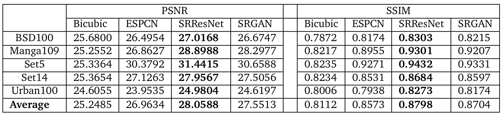
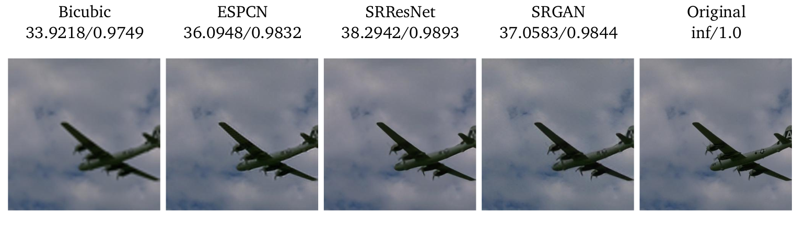
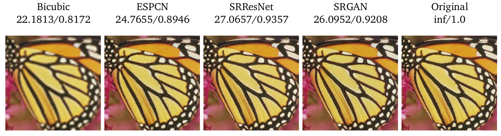
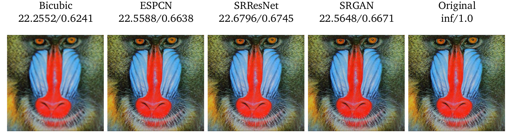
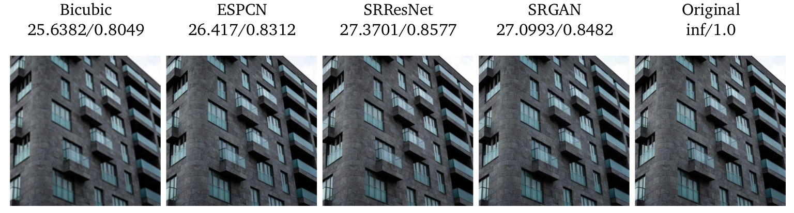

Setup environment
===
```
conda env create -f env.yml
conda activate env_36
```
- For running on colab: simply upload this repos to colab and run

Data Preprocessing
===
Download data and pretrained models at: https://husteduvn-my.sharepoint.com/:f:/g/personal/nghia_vt173284_sis_hust_edu_vn/EozFDBAS77dJmsbGvRvDswIB5O0P6ucF5OcU9U10jN8NvQ?e=XHVAb9

Save data at "dataset" folder

Save models at "pretrained-models" folder

Create "logs" folder

Generate train and test dataset:
```bash
python generate_data.py
```
- Only generate scale 4 dataset for test dataset
- Simply compress images in train folder to pkl files to load faster in colab

Training
===
Output includes:
- logs file at logs folder
- model checkpoint at models folder
- images at experiments folder

Train ESPCN
- From scratch
```
python train_ESPCN.py --num_epochs 10
```
- From pretrained model
```
python train_ESPCN.py --weights pretrained-models/ESPCN.pth --num_epochs 10
```
Train SRResNet

```
python train_SRResNet.py --num_epochs 1
python train_SRResNet.py --weights pretrained-models/SRResNet.pth --num_epochs 1
```
Train SRGAN
```
python train_SRGAN.py --num_epochs 1
python train_SRGAN.py --weights_G pretrained-models/SRGAN_G.pth --weights_D pretrained-models/SRGAN_D.pth --num_epochs 1
```
Testing
===
Output includes:
- logs file at logs folder
- image at experiment folder

Test ESPCN
```
python test.py --model ESPCN --weights pretrained-models/ESPCN.pth
```
Test SRResNet
```
python test.py --model SRResNet --weights pretrained-models/SRResNet.pth
```
Test SRGAN
```
python test.py --model SRGAN --weights pretrained-models/SRGAN_G.pth
```
Test BICUBIC
```
python test_BICUBIC.py
```
Inference
===
ESPCN
```
python inference.py --input input.jpg --weights pretrained-models/ESPCN.pth --model ESPCN
```
SRResNet
```
python inference.py --input input.jpg --weights pretrained-models/SRResNet.pth --model SRResNet
```
SRGAN
```
python inference.py --input input.jpg --weights pretrained-models/SRGAN_G.pth --model SRGAN
```
Hyperparameters - Model Architecture
===
Change model architecture at: models.py

Empirical Results
===





